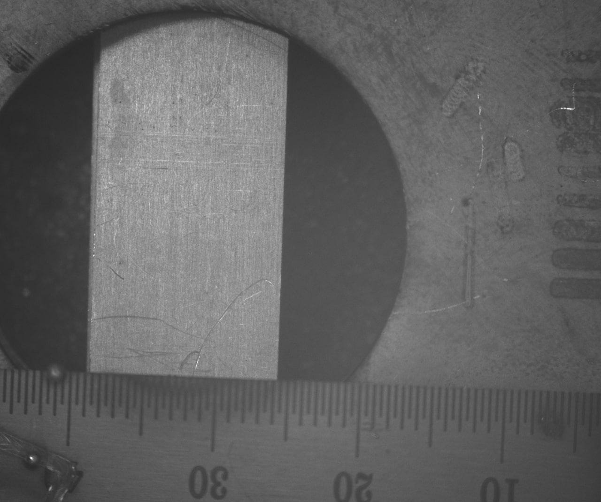
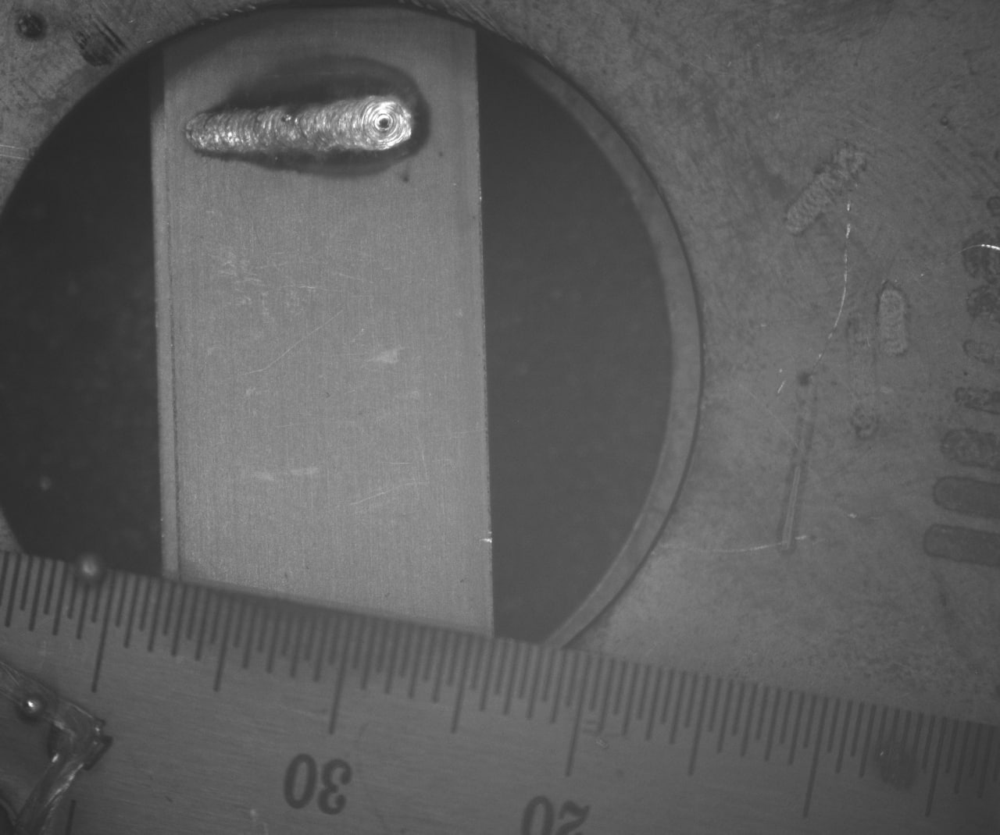
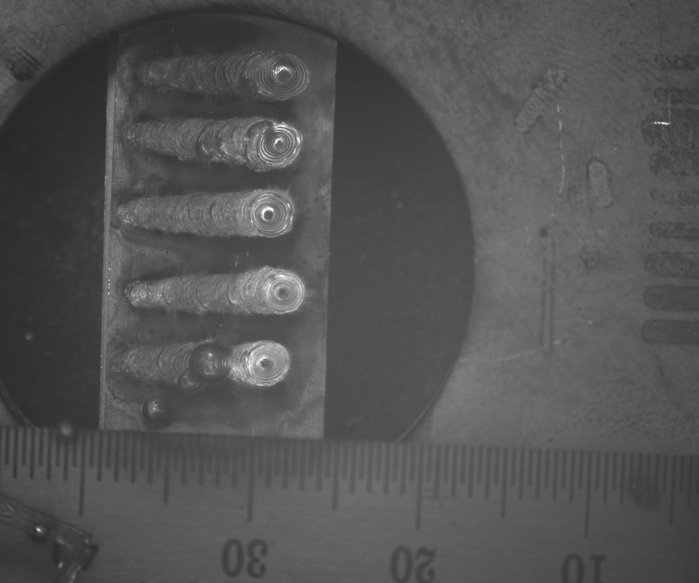
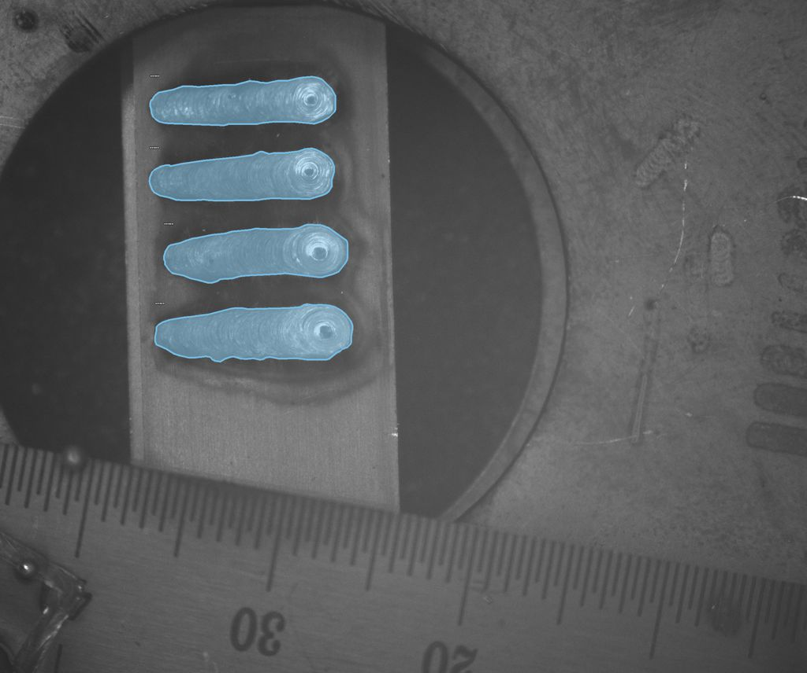
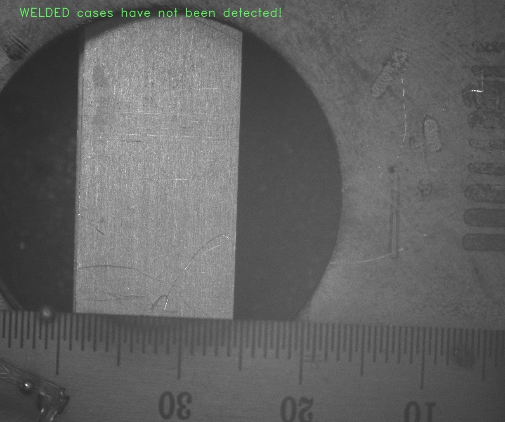
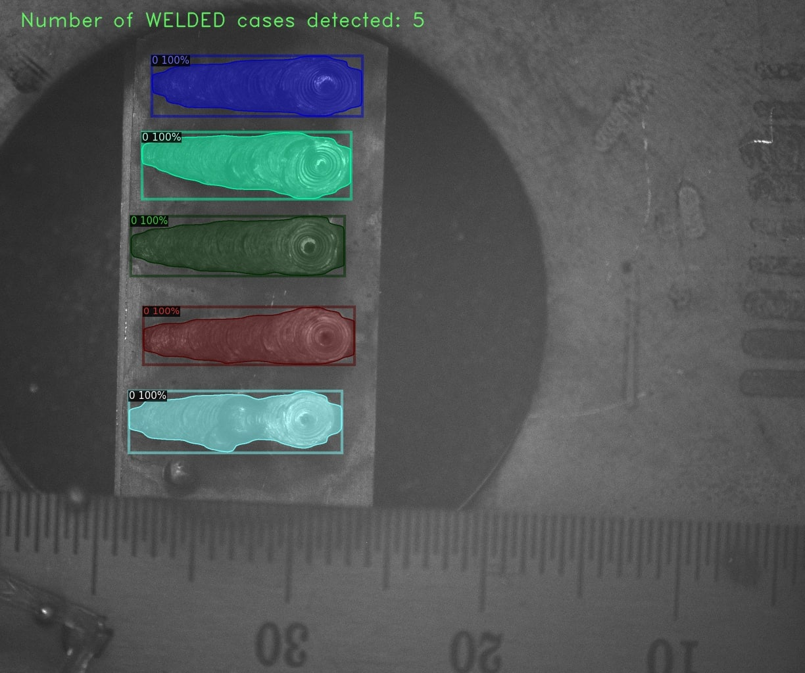
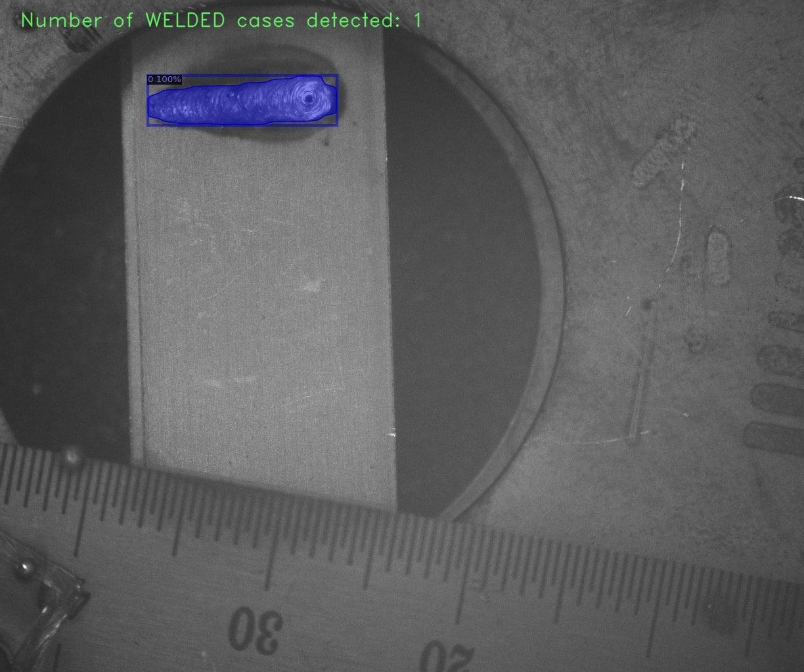

## Semantic Segmentation with Transfer Learning 

In this project I trained custom detaset.  

### Dataset annotation 
I have used coco-annotator tool for labeling the custom data. We have stored label details in jason file and pu it in training and validation folders

3 samples of the dataset






labelled image 


The model was fine tuned for 100 epochs. 

The segmentation output of the model on a sample image are shown below.






### Installing dependencies

#### Using pip

```
pip install -r requirements.txt
```

#### Using conda
```
conda env create -f environment.yml
```

### Usage of the module

```
Usage: main.py [OPTIONS]

Options:
  --data-directory TEXT  Specify the data directory.  [required]
  --exp_directory TEXT   Specify the experiment directory.  [required]
  --epochs INTEGER       Specify the number of epochs you want to run the
                         experiment for. Default is 25.

  --batch-size INTEGER   Specify the batch size for the dataloader. Default is 4.
  --help                 Show this message and exit.
```

To run the code with the CrackForest dataset and store the results in folder called CFExp use the following command.

```
python main.py --data-directory CrackForest --exp_directory CFExp
```

The datahandler module has two functions for creating datasets fron single and different folders.

1. ```
   def get_dataloader_sep_folder(data_dir: str,
                              image_folder: str = 'Image',
                              mask_folder: str = 'Mask',
                              batch_size: int = 4)
    ```
    Create Train and Test dataloaders from two separate Train and Test folders. The directory structure should be as follows.
    ```
    data_dir
    --Train
    ------Image
    ---------Image1
    ---------ImageN
    ------Mask
    ---------Mask1
    ---------MaskN
    --Train
    ------Image
    ---------Image1
    ---------ImageN
    ------Mask
    ---------Mask1
    ---------MaskN
    ```

2. ```
   def get_dataloader_single_folder(data_dir: str,
                                 image_folder: str = 'Images',
                                 mask_folder: str = 'Masks',
                                 fraction: float = 0.2,
                                 batch_size: int = 4)
   ```

    Create from a single folder. The structure should be as follows.
    ```
    --data_dir
    ------Image
    ---------Image1
    ---------ImageN
    ------Mask
    ---------Mask1
    ---------MaskN
    ```

The repository also contains a JupyterLab file with the loss and metric plots as well as the sample prediction code.

## Citation

If you found this repository to be useful and use it in your work, please consider citing it:

Bibtex Entry:

@misc{minhas_2019, title={Transfer Learning for Semantic Segmentation using PyTorch DeepLab v3}, url={https://github.com/msminhas93/DeepLabv3FineTuning}, journal={GitHub.com/msminhas93}, author={Minhas, Manpreet Singh}, year={2019}, month={Sep}}

IEEE Format Citation:

M. S. Minhas, “Transfer Learning for Semantic Segmentation using PyTorch DeepLab v3,” GitHub.com/msminhas93, 12-Sep-2019. [Online]. Available: https://github.com/msminhas93/DeepLabv3FineTuning.
